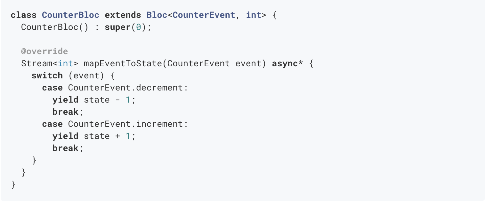
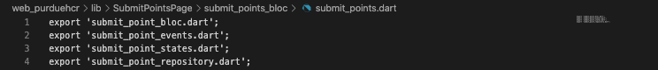
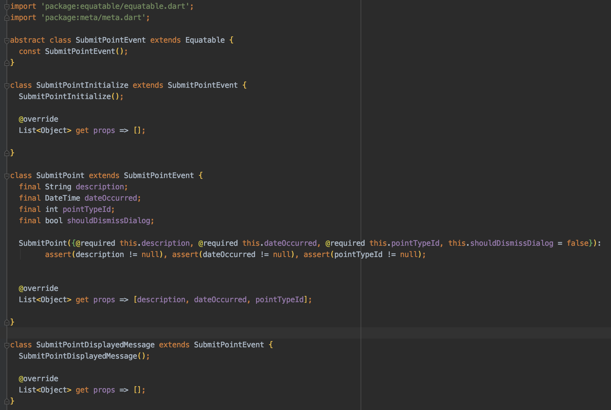
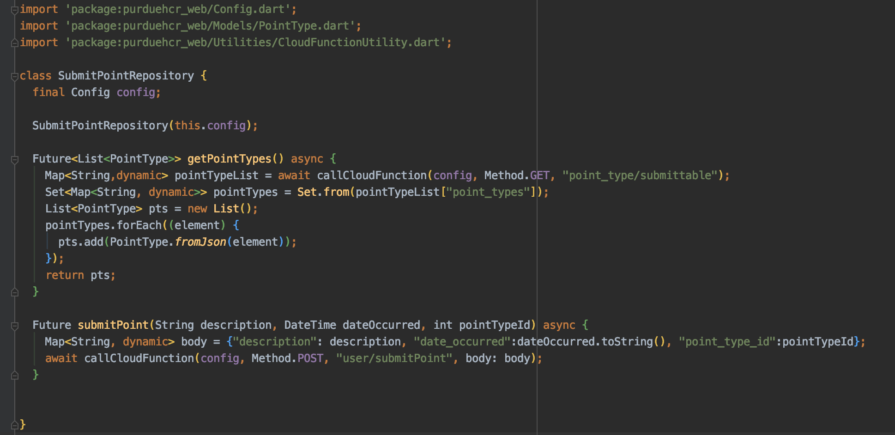
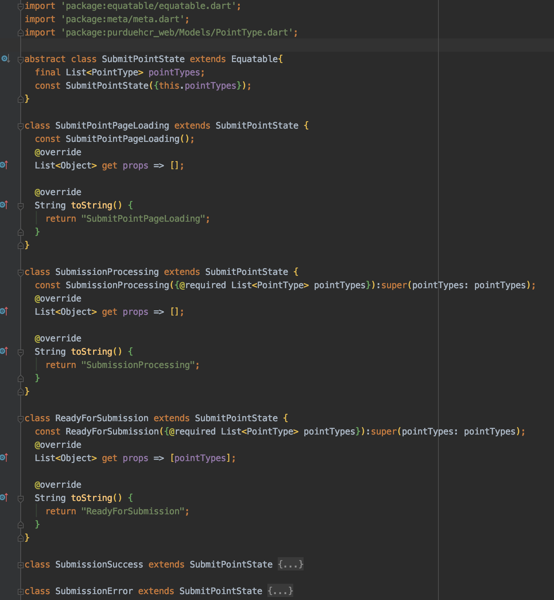
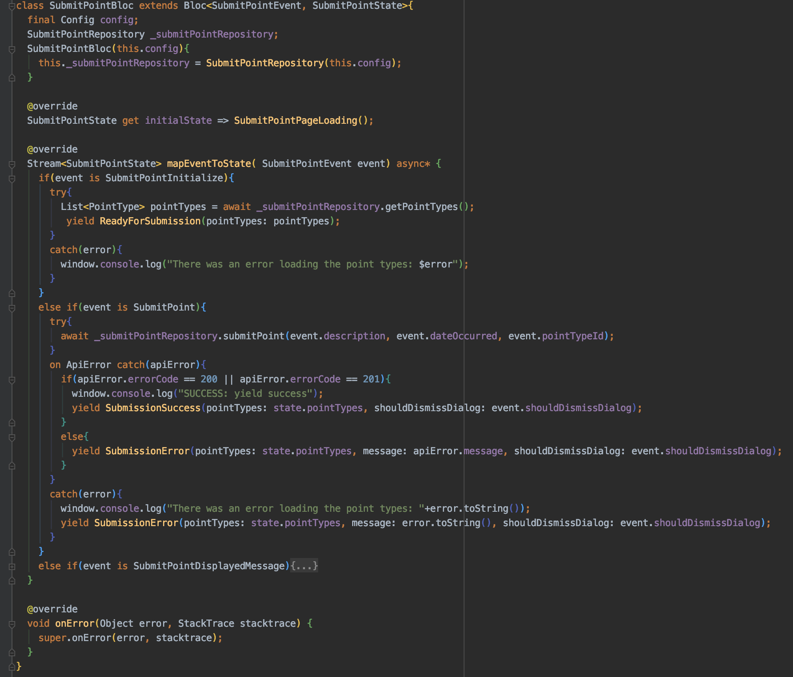
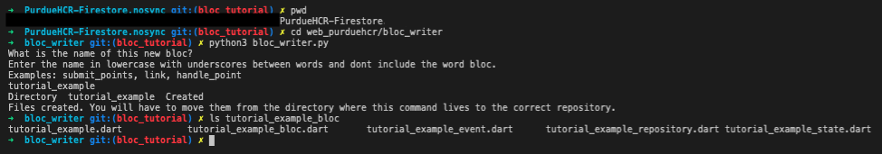

# Creating PurdueHCR Business Logic
Written on 7/5/2020 by Brian Johncox

## Overview
This article is designed to explain how to create Business Logic Components (BLoC) and how it is used in the PurdueHCR Flutter project. It is highly recommended that you have read through [Understanding The Bloc Pattern](../Understanding_The_BLoC_Pattern) or have an understanding of how the BLoC pattern works before you start.

## The flutter_bloc dependency

[Flutter_bloc](https://pub.dev/packages/flutter_bloc) is a Flutter dependency by bloclibrary which combines the dependency [bloc](https://pub.dev/packages/bloc) with several helpful widgets to help implement the BLoC pattern in apps. The widget part of flutter_bloc will be discussed in [Using BLoCs in PurdueHCR Widgets](../Using_BLoCs_in_PurdueHCR_Widgets), so in this article, we will focus on how the bloc dependency is used. 

### The BLoC Object

*Fig 1. Example of a Counter Bloc which uses the Bloc class. Image credit: https://pub.dev/packages/bloc*

*Fig 2. Example of an Event class. Image credit: https://pub.dev/packages/bloc*

The Bloc<Event,State> class is the base class provided to us by the bloc dependency. Any BLoC that you make will extend this class which takes two generic type parameters. The first it takes is the type that you will use for Events. In the example above, CounterEvent is the type that CounterBloc will use as events. The second generic type is the type for the state. In the CounterBloc example, the state is an integer, which when initialized, the constructer sets to 0 by calling super(0); This makes sense as a counter really only cares about the single number that it needs to track.

So how does the CounterBloc handle the request to change the state? All the magic happens in the mapEventToState method. This method takes in an event, then, depending on the event, performs the logic and yields back the new state. The important keywords are defined below.

**Stream\<int\>:** The way that the BLoC pattern keeps the view up to date is by using a Stream. A Stream allows for a continuous flow of information which and is made of a sink and a stream (lowercase). The sink is the element which takes in an event and in the BLoC pattern is the BLoC element itself and the stream is the flow of results to that event. So the return type of Stream means that overtime new information will be available to use. The generic parameter of \<int\> means that the state that will be sent back in the stream is of type int.

**mapEventToState(CounterEvent event):** This says that whenever an event is published to the Bloc, which, reminder, is acting as the sink for this Stream, the event will be of type CounterEvent. 

**async\*:** The keyword async is used to denote that this method might run asynchronously and that the calling function should not expect a result immediatly. When called, the Flutter Event Loop can move on and come back to handle the result of this code later. Async also permits the method to return a Future object or use the await keyword to handle a Future. Async* is almost the same, but allows the return type to be a Stream.

**yield:** The keyword 'yield' is very similar to the keyword 'return'. It takes the object that is given and sends it to the calling code. However, while return gives the value directly to the calling function, yield sends the value to the stream to be handled.

## The BLoC Pattern in PurdueHCR

### Overview

In the PurdueHCR app, there are 2 levels of BLoCs: global and page based. The global BLoC is the AuthenticationBloc. This BLoC is used to save information pertinent to the entire app such as the current authentication status (Authenticated, Unauthenticated, etc) and when authenticated, the user model. For the most part, this BLoC's code will not need to be modified since it is already available to every page in the app.

The more pertinent BLoCs are the page based BLoCs. The general concept for our app is that every page gets its own BLoc, so this is where most of the development will occur. When you make a new page, you will create a folder that includes widgets used in the page and the folder that contains the BLoC files.

*Fig 3. Example of a Page and its BLoC in PurdueHCR*

### BLoC Files

In each BLoC folder, there are 5 files: the header file, the bloc file, the events file, the repository file, and the states file.

**Header file:** The header file is named `<BLOC_NAME>.dart`. This file exports the other 4 files to simplify importing them into other files.

*Fig 4. Example of a BLoC header file*

**event file:** The event file is named `<BLOC_NAME>_events.dart` and contains all the event classes. Each event class extends a common abstract event class that will be used to define the event type in the BLoC. Each event also must implement the get props field to follow the Equatable interface. This is used to uniquely define Events based on its parameters. Otherwise passing the same event twice, even with different data, would not cause a new state to be yielded. You should have an event for every time that data needs to change on the UI. This is any time a user needs to make a request to the API or if the view needs to prompt a change, like stop showing an error. Note: some state changes are included in the widget itself. For example, you do not need to have an event for a user typing into a text field because the TextField widget handles that for us.

*Fig 5. Example of a BLoC events file*

**repository file:** The repository file is named `<BLOC_NAME>_repository.dart` and handles all of the calls to the API. Each method returns a Future with the correct return type to allow for asyncronous calls to the server.

*Fig 6. Example of a BLoC repository file*

**state file:** The state file is named `<BLOC_NAME>_statesdart` and defines all of the possible states for the BLoC along with all required values. Each state can have its own parameters, ie a state for receiving an Error Message, or share a parameter from a base state class, ie a list of values retriieved from the server that you dont want to have to request again.

*Fig 7. Example of a BLoC states file*

**bloc file:** The bloc file is named `<BLOC_NAME>_bloc.dart`. This file contains the extension to the base BLoC object and is the center for the logic that occurs. 

*Fig 8. Example of a BLoC file*

### Creating a new BLoC
Because there is several lines of boilerplate code for creating a BLoC, we have created a python script that will simplify the process. To run it, you have to open a bash terminal and cd into /web_purduehcr/bloc_writer. From there you can type `python3 bloc_writer.py` to create a folder with base code for the bloc. One caveat, however, is that after running the command, you will have to move the folder into the correct directory.

*Fig 9. Example of how to create boilerplate for a new BLoC*

### Expanding a BLoC
When adding new features to a BLoC, it is best to start by thinking about what event is occuring that will prompt a change. For example, if the event is submitting a point, what fields should be passed with the event? Once you have the event created, think about what state will be presented while and after the event happens. If the event needs to use the API, should an intermediary loading state be yielded? What happens once the api response is received? Should it go back to a preexisting state, or do you need a new one? Third, create the required requests in the Repository. If the event will require an API call, setup a method now. Lastly, handle the event in the mapEventToState method in the bloc file. 

## Conclusion

That is an overview of how the BLoC logic is currently being used in PurdueHCR, but this is not the full picture yet. To see how to utilize a BLoC in a widget, check out the article on [Using BLoCs in PurdueHCR Widgets](../Using_BLoCs_in_PurdueHCR_Widgets).