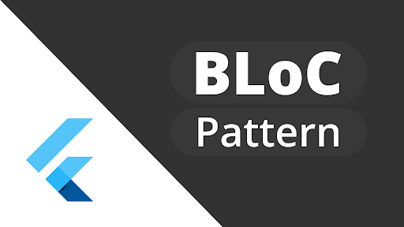

# The BLoC Pattern
Written on 7/5/2020 by Brian Johncox

*Image credit: flutterdevs.com*

## What is the BLoC Pattern
The Business Logic Component (BLoC) pattern is a pattern designed by engineers at Google as a new way to track states in your code. For comparison, lets look at the difference between the BLoC pattern and the popular Model View Controller (MVC) pattern.

### The Model View Controller Pattern

*Fig 1. Flow of the MVC Pattern. Image credit: www.geeksforgeeks.org/mvc-design-pattern/*

In the MVC pattern, the stucture is split into 3 elements, the Model, the View, and the Controller. The Model consists of your data classes. For example, if you were writing code for Minecraft, a Dirt Block would be an example of a model. It has a state (position, isCoveredInGrass, hardness, etc) and modifiers (setPosition, coverInGrass, etc). 

The View is the graphics object that is being shown to the user. In Minecraft, it would be the images that are drawn on the screen to show the dirt block. 

The controller is the go between for the Model and the View. When something happens on the View, like a dirt block being mined, the View tells the Controller that something is happeneing. Then the Controller modifies the Model to reflect the new state of the Model. For example, telling the dirt block model that the block has been mined, so its position should be null. Or if playing on a server, the controller would tell the server that a block has been mined, wait until the server responds, then update the Model. 

Once the Model has been updated, the Controller, then tells the View to redraw itself using the new state of the Model, or in our example, having the view update to show that the dirt block is not in its original place, but instead is the 'dropped' version of the block on the ground.

### The BLoC Pattern

*Fig 1. Flow of the BLoC Pattern. Image credit: https://medium.com/flutterpub/architecting-your-flutter-project-bd04e144a8f1*

The BLoC pattern, like the MVC pattern, has the end goal of taking user actions, updating the data source or model, and changing what the user sees. While the goal is similar, they handle this in different ways.

The BLoC pattern is made up of 5 parts. The View, the State, the Events, the BLoC, and the Repository. The State represents all of the current data being used, similar to the collection of Models in an MVC Controller. In Minecraft, you could think of the State as being a collection of all the blocks visible on the screen, along with any things else that is currently happening: rain, day/night, player position, etc.

Events represent actions that the user is taking and things that need to be responded to. Examples in Minecraft would be pressing the up key to move, clicking to start mining, or opening the inventory menu.

The View is going to be the original source of the Events. When the View gets notification of user input, it will create an event and publish it to the BLoC.

The BLoC element in the BLoC pattern is the most similar to the Controller in MVC. The Bloc is going to be listening for events from the view, and when it gets one, the BLoC will perform the necessairy actions then yield a new State for the view to redraw itself with. For example, when in Minecraft a user clicks on a dirt block, the view will publish an OnClickBlock event which the BLoC will receive. The BLoC element will then create a new State with the changes for mining the dirt block, and yield that new State back to the View which will redraw itself to represent the new changes.

The Repository and the Network Provider are the elements which handle the actions to update the state. They will take the current state, perform the actions and contact a server if need be, then give back to the BLoC any changes that were made.

## Why is the BLoC pattern useful in Flutter

The big reason that the BLoC pattern is useful in Flutter is because there is not a seperate language for creating the UI and handling the data. Comparing Flutter to Android or iOS development, you see that Android uses XML files to design its UI and Java for the Models and the Controller. iOS uses storyboards to design the UI then Swift or Objective-C files to write the Models and Controllers. 

Flutter does not have seperate languages and files for views and controllers. You write the UI in the language dart in a file that contains a Widget class, and you modify the data and state in that same file. This results in complicated and large files that are difficult to read through.

The BLoC pattern helps allievate the problem by putting the business logic in seperate files. Now when an update needs to be performed, the Flutter Widget can publish an event which the BLoC, in a seperate file, will handle. This makes for cleaner, more understandable, and more mainable code.

## Conclusion

Now that you understand a little about what the BLoC pattern is and why it is helpful, checkout the articles on [Creating PurdueHCR Business Logic](../Creating_PurdueHCR_Business_Logic) and [Using BLoCs in PurdueHCR Widgets](../Using_BLoCs_in_PurdueHCR_Widgets).

If you are looking to get a deeper understanding of the BLoC pattern or to learn about how the low level components work, check out [this article](http://flutterdevs.com/blog/bloc-pattern-in-flutter-part-1/) by Flutter devs.