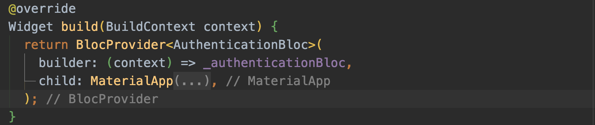

# Using BLoCs in PurdueHCR Widgets
Written on 7/5/2020 by Brian Johncox

## Overview
This article will cover the basic usage of BLoCs in a widget, the 2 BLoC widgets provided in flutter_bloc, and how BLoCs are commonly implemented in PurdueHCR. For references about what the BLoc Pattern is or how to implement it, checkout [Understanding the BLoC Pattern](../Understanding_The_BLoC_Pattern) and [Creating PurdueHCR Business Logic](../Creating_PurdueHCR_Business_Logic).

[Flutter_bloc](https://pub.dev/packages/flutter_bloc) is a Flutter dependency by bloclibrary which combines the dependency [bloc](https://pub.dev/packages/bloc) with several helpful widgets to help implement the BLoC pattern in apps. The widgets which will be the most useful are BlocProvider and BlocBuilder.

## LifeCycle of a BLoC

### 1. Instantiation
To use a BLoC in a StatefulWidget, declare an instance of the BLoC in the State object. Then in either the initState() or didChangeDependencies() method, initialize your BLoC by providing the Config object. Lastly use the .add(Event e) method to send an initialize event to your BLoC. 

While your BLoC will have an initial state, you should create an Event to initialize your BLoC so that when the Widget is ready, it will send of a request to the API to start loading the data. In the example below, that Event is called AppStarted() but other pages may call it Initialize().
<span style="display:block;text-align:center">
*Fig 1. Example of how to declare and initialize your BLoC. Use the .add(Event e) method to send an event to your BLoC.*
</span>

### 2. Post Events
BLoCs are used to both handle events and to update the state of the UI. To add an event to the BLoC, you will use the .add(Event e) method. Some examples are below.
<span style="display:block;text-align:center">
*Fig 2. Example of adding an OverviewLaunchedEvent(PermissionLevel) to the Overview Bloc to handle initialization of the page.*
</span>
<span style="display:block;text-align:center">
*Fig 3. Example of adding a Submit Point Event to the submitPointsBloc to handle a point submission.*
</span>

### 3. Sharing a BLoC with Children
The BLoC provider widget is a helpful tool for sharing BLoCs with child widgets. This means that a BLoC only needs to be defined in one Widget. This is helpful because every time that a BLoC is instantiated, it also has to be closed when the Widget is destroyed. With BlocProvider, multiple widgets have access to the BLoC but only the parent has to destory it.
<span style="display:block;text-align:center">
*Fig 4. Example of how to use a Bloc Provider*
</span>

To access the BLoC in a child, you just have to request the BLoC with the given BuildContext in the child's initState method.

<span style="display:block;text-align:center">
*Fig 5. Example of how to access a BLoC in a child widget of BlocProvider. Note that this initState is in a child of the MaterialApp show in in Figure 1.*
</span>

### 4. Responding to State Changes

Whenever a BLoC receives an Event, the BLoC will process that event in the mapEventToState method and will yield an update to the current state. 

A BlocBuilder is a powerful widget that flutter_bloc provides to handle changes in state from the BLoC. When creating a BlocBuilder, the type of the BLoC and the type of the State must be provided (line 18 in image below). For parameters, the bloc to be used must be given (line 19) as well as a Builder method that takes the BuildContext and the current state of the BLoC (line 20).

The example below shows how to pass a BLoC to a BLoCBuilder and how to respond to the changing of states.
<span style="display:block;text-align:center">
*Fig 6. Example in the RouteGenerator class that uses the BLoC passed from the AuthenticationBloc BlocProvider and displays different UI elements based on the state.*
</span>


### 5. Closing the BLoC
Once a BLoC is no longer in use, it is an the end of its lifecycle and must be closed. The reason it must be closed is that a BLoC builds upon the foundation of a Stream, and a Stream must be informed when it is no longer in use so that it doesn't use processing power to check for more updates.

Override the dispose method in the parent widget where the BLoC was created, and close the BLoC therein.
<span style="display:block;text-align:center">
*Fig 7. Example of how to close a BLoC in the owning Widget's dispose method. Note: Only close a BLoC once and only do it in the Widget where the BLoC was created.*
</span>

## Implementing BLoC Widgets in PurdueHCR
In the PurdueHCR app, there are 2 levels of BLoCs: global and page based. The global BLoC is the AuthenticationBloc. This BLoC is used to save information pertinent to the entire app such as the current authentication status (Authenticated, Unauthenticated, etc) and when authenticated, the user model. For the most part, this BLoC's code will not need to be modified since it is already available to every page in the app.

The more pertinent BLoCs are the page based BLoCs. The general concept for our app is that every page gets its own BLoc, so this is where most of the development will occur. When you make a new page, you will create a folder that includes widgets used in the page and the folder that contains the BLoC files.

### BLoCs in a BasePage
Whenever you create a page in the PurdueHCR app that needs to have the side menu available, you should extend the BasePage class. Thanks to recent advances, there is very little work that needs to be done to use a BLoC when you extend the BasePage class. the Base Page handles creating the BlocBuilder as well as using the AuthenticationBloc BlocProvider to get access to the authentication status. 

When you extend a BasePageState, you have to provide three types in the generics. First is the type for the BLoC. Second is the type for the Event. Third is the type for the States. (Line 22 in Fogure 8).

Declaring and initializing a BLoC is pretty much the same as how a BLoC is defined in a normal Stateful Widget.
<span style="display:block;text-align:center">
*Fig 8. Example of how to setup a Bloc in a page that extends a BasePage*
</span>

In an extension of a BasePage, the BlocBuilder is already implemeted in the three required build methods. When creating the body methods, handle the different states.
<span style="display:block;text-align:center">
*Fig 9. Example of how to handle changes in state in a BasePageExtension*
</span>

Lastly, there are two more methods which utilize the BLoC. The first is the getBloc method. This should return the bloc instance that was created in the init state. The second method is the isLoadingState. This method checks the current state against one you declare as the loading state. This simplifies showing the loading symbol when data is not yet ready to be displayed.
<span style="display:block;text-align:center">
*Fig 10. Other methods that must be implemented when extending Base Page.*
</span>


### BLoCs in Pages that do not extend Base Page
When using a BLoC in a page that does not extend Base Page, the format looks very similar to how the implementation was discussed in the LifeCycle section. You declare and initialize the BLoCs as shown above, dispose of the BLoC in an overriden dispose method, and use BlocBuilder to handle changes.
```
import 'dart:html';

import 'package:flutter/material.dart';
import 'package:flutter_bloc/flutter_bloc.dart';
import 'package:purduehcr_web/Account_Login_Creation/account_bloc/account.dart';
import 'package:purduehcr_web/ConfigWrapper.dart';
import 'package:purduehcr_web/Utilities/DisplayTypeUtil.dart';
import 'package:purduehcr_web/authentication/authentication.dart';


class LogInPage extends StatefulWidget {

  LogInPage({Key key}) : super(key: key);

  @override
  State<StatefulWidget> createState() {
    return LogInPageState();
  }

}
class LogInPageState extends State<LogInPage> {
  AccountBloc _loginBloc;

  //Ignore close sink because it will be closed elsewhere
  // ignore: close_sinks
  AuthenticationBloc _authenticationBloc;


  @override
  void initState() {
    _authenticationBloc = BlocProvider.of<AuthenticationBloc>(context);
    window.console.log("Init State");
    super.initState();
  }

  @override
  void didChangeDependencies() {
    super.didChangeDependencies();
    _loginBloc = AccountBloc(
      config: ConfigWrapper.of(context),
      authenticationBloc: _authenticationBloc,
    );
    _loginBloc.add(AccountInitialize());
  }

  @override
  Widget build(BuildContext context) {

    final bool isDesktop = isDisplayDesktop(context);

    return Scaffold(
      backgroundColor: Color.fromARGB(255, 220, 220, 220),
      body: BlocBuilder<AccountBloc, AccountState>(
        bloc: _loginBloc,
        builder: (context, state) {
            if(isDesktop){
                return _createDesktop(state);
            }
            else{
                return _createMobile(state);
            }
        },
    );
  }

  Widget _createDesktop(AccountState state){
    Widget child;
    if(state is AccountLoading){
      ...
    }
    else if(state is AccountError){
      ...
    }
    else {
      ...
    }
  }

  Widget _createMobile(AccountState state){
    ...
  }

  Widget _createLoadingCard(){
    ...
  }

  Widget _createLoginCard({String error = ""}){
    ...
  }

  @override
  void dispose() {
    super.dispose();
    _loginBloc.close();
  }
}
```

### BLoCs in other StatefulWidgets
The pattern that the development team has chosen to follow is to only create BLoCs in Widgets that represent a page of the app. As such, other stateful widgets should not be creating or using their own BLoCs. If you find yourself creating a widget that needs access to data, think about how you can pass data down from the parent page widget to your widget. If your child widget handles an action, think about how you can pass closures/anonymous functions down to the child to handle the updating of data. Several of the widgets in the Utility_Views folders use this correctly. 

However, if there is no other option aside from using a BLoC in the child widget, you should declare the BLoC in the parent widget and use a BlocProvider to pass the BLoC down to the child so it may be disposed of properly when the page is disposed.

## Conclusion
That was a brief overview of how to use BLoCs in widgets in the PurdueHCR App. While this does not cover every aspect of BLoCs, this should be enough to help you get started and to know where to look to see examples in other files for how to implement the BLoC Pattern.