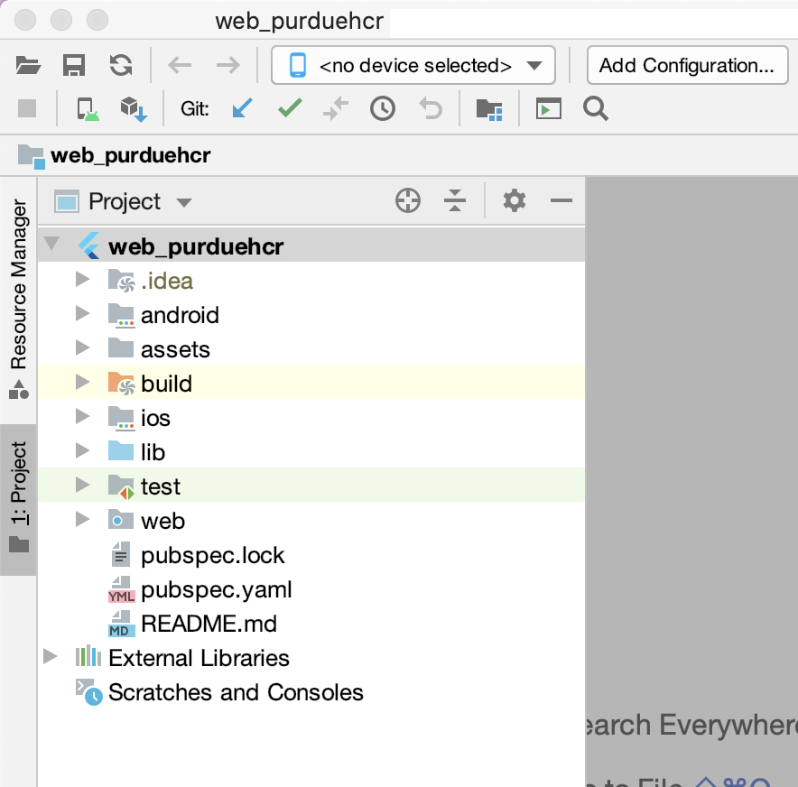
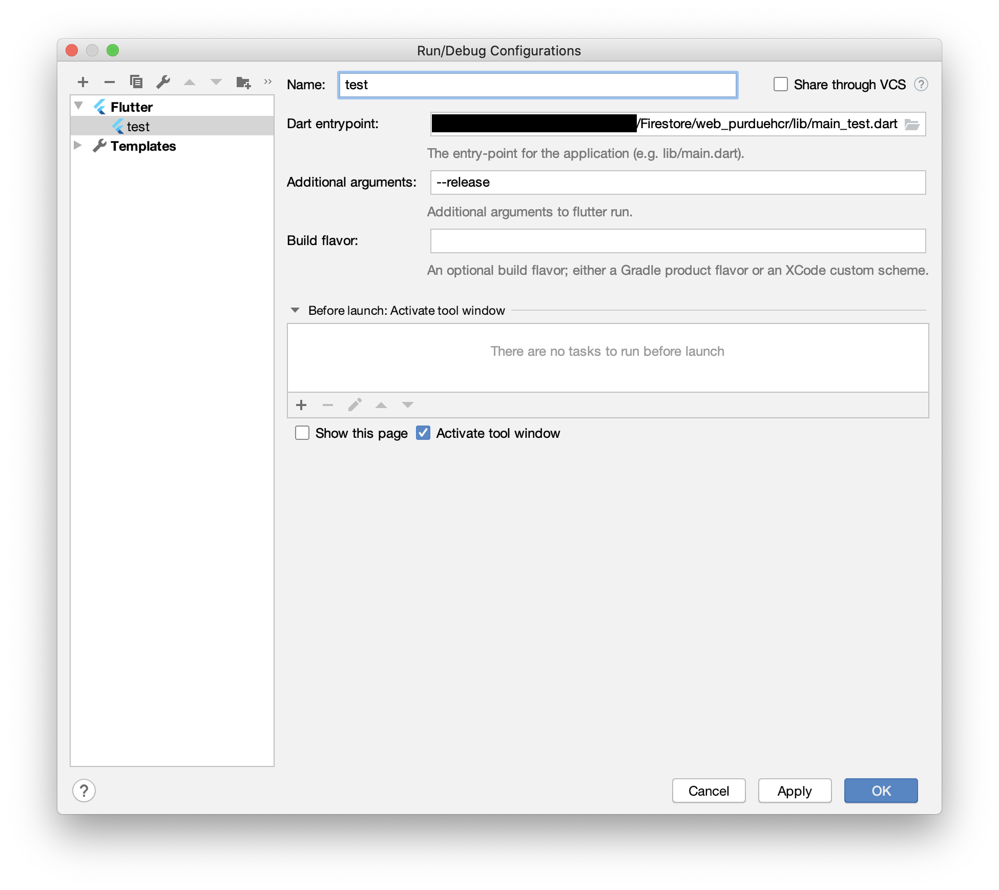
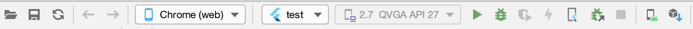

# PurdueHCR Flutter

Flutter Web App for PurdueHCR

## Getting Started With Android Studio

Once you have the code base downloaded, open web_purduehcr in Android Studio. On the left side of Android Studio you will see a Project Manager which lists all of the folders and files. On the top bar, you will see a dropdown that says 'no device selected' and a button that says Add Configuration.



To add a run configuration, you will first need to contact a PurdueHCR exec member. They will have files for you to download and place in the folder lib/env/.

### Run Configuration

Once you have those downloaded, you will have to create a new run configuration for each of those files. To create the configuration for test, click the Add Configuration button. 

In the popup window, click the plus button at the top left, and choose Flutter. In the name field, type "test". In Dart entrypoint, click the folder icon and navigate to the file lib/main_test.dart. In additional arguments type '--release'. Click Apply and repeat for the other files you were given.


### Flutter Configuration

This project uses Flutter Web which is currently in Beta. That means you will need to go to your terminal and run the following commands.
```bash
flutter channel beta
flutter upgrade
flutter config --enable-web
flutter devices
```

The command `flutter devices` will print out the list of available devices you can run the app on, and you should see Chrome listed as an option. 

If you go back to Android Studio and click on the device selection dropdown, Chrome should now be an option.



Click the green play button, and the web app will launch.

If you have problems with the installation, check out Google's Flutter Web Installation [page](https://flutter.dev/docs/get-started/web).

If you have updates to these instructions, feel free to open a pull request with changes.

## Create a new page for the App

All pages that are not about user or account creation need to extend the BasePage class to have access to the side bar menu.

To create a BLOC for a page, look at the Random Project Notes below to see a shortcut for creating them.

To add a page to the navigation menu, you have to go to the PhcrDrawer class, add a const variable for the page and add it to the lists of permissions for user types.

Then, go to RouteGenerator and add the logic to the if statements to handle that route

## Flutter Resources 

If this is your first time working on a Flutter Project, checkout the resources below.

A few resources to get you started if this is your first Flutter project:

- [Lab: Write your first Flutter app](https://flutter.dev/docs/get-started/codelab)
- [Cookbook: Useful Flutter samples](https://flutter.dev/docs/cookbook)

For help getting started with Flutter, view our
[online documentation](https://flutter.dev/docs), which offers tutorials,
samples, guidance on mobile development, and a full API reference.

## Random Project Notes
To build the .g files for json_serialize, run `flutter packages pub run build_runner build --delete-conflicting-outputs`

I included a tool to build the templates for a BLOC. Navigate into web_purduehcr/bloc_writer and run `python3 bloc_writer.py` You will have to move the folder into the correct directory afterwards


